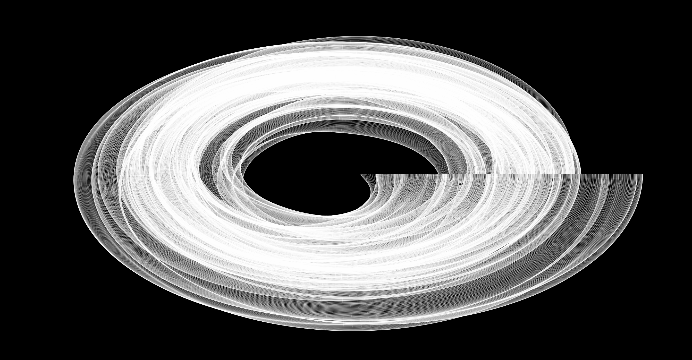

# Diastole

\
\
Diastole is an audio-reactive piece created using the p5.js library.
\
\
This work began with Carl Lostritto's "squiggle" example discussed in his text "Computational Drawing" [1]. The work uses 2-dimensional perlin noise to guide the procedural evolution of the shape. The x-dimension is used to control how the radius fluctuates per squiggle. The y-dimension determines the offset between each squiggle, rendered once per frame. The audio volume scales this offset, and the spectral centroid moves the structure inwards/outwards for low/high frequencies respectively.   

# Results

# References

[1] **Computational Drawing: From Foundational Exercises to Representation** by Carl Lostritto, 2022. [Amazon](https://www.amazon.co.uk/Computational-Drawing-Foundational-Exercises-Representation/dp/1940743265)
